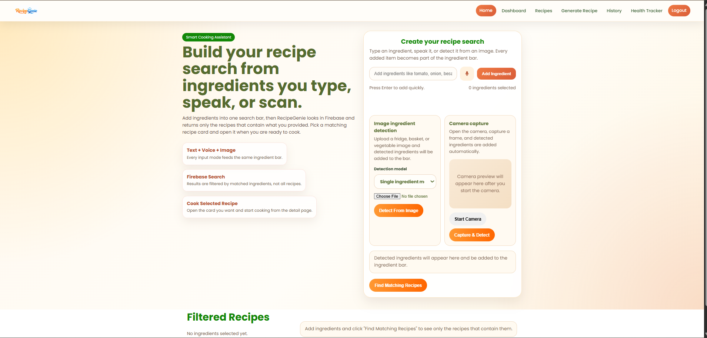
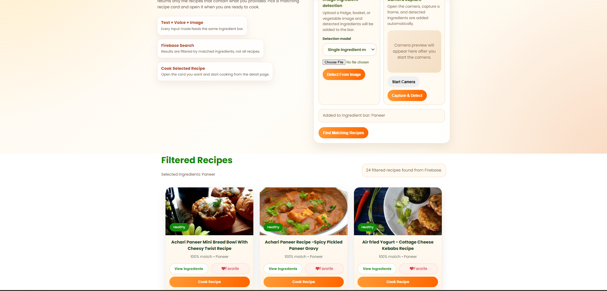
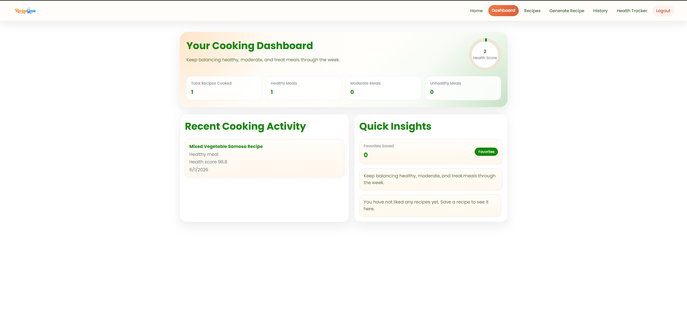
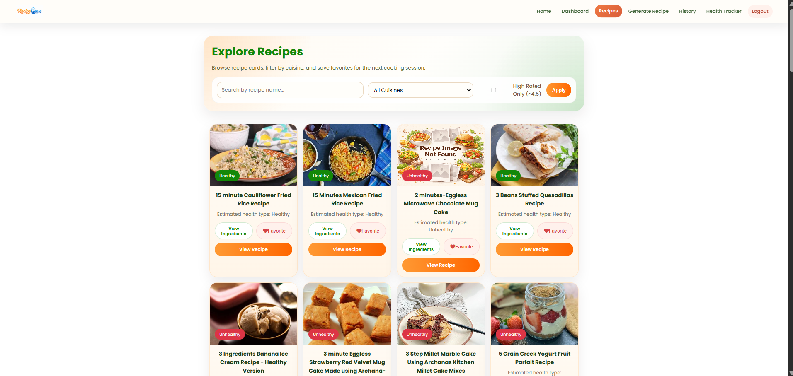
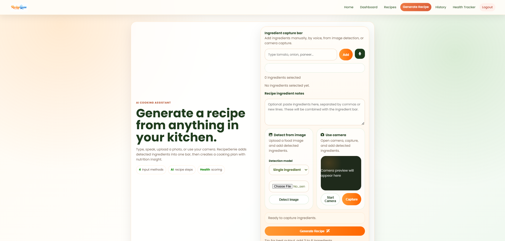
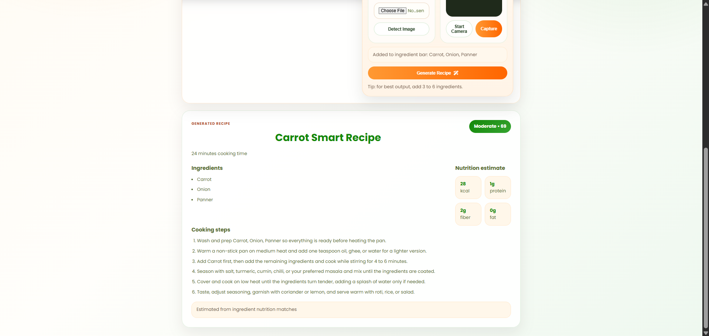
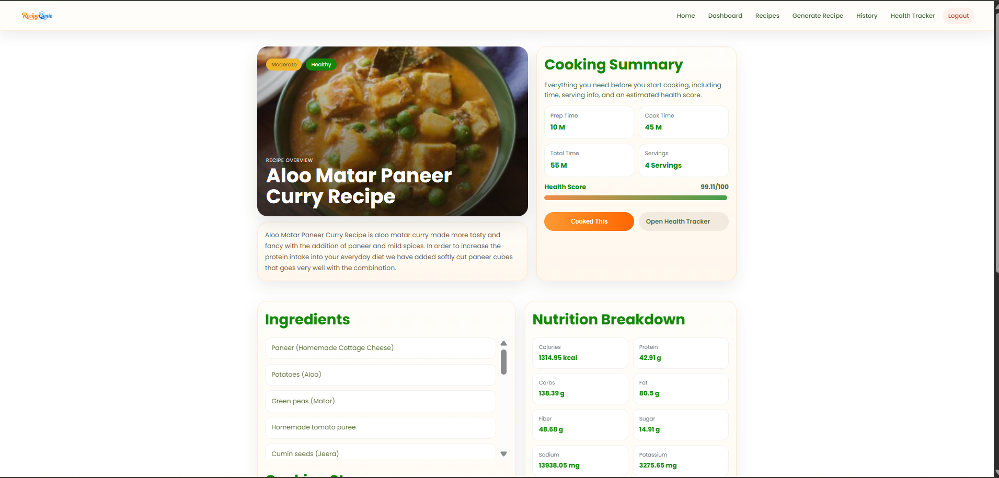
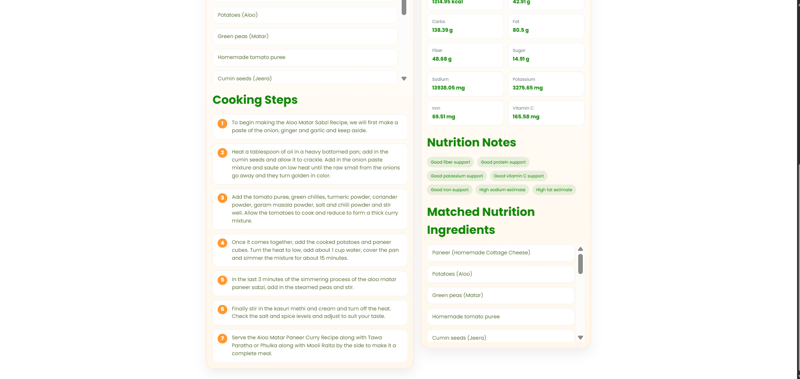
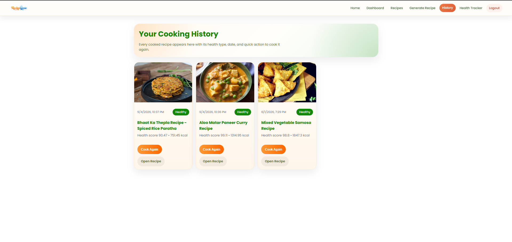
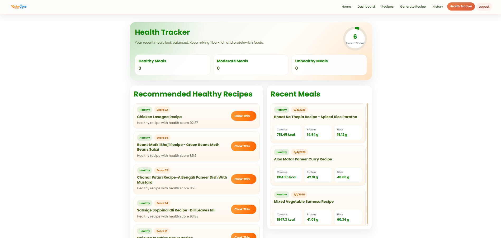

# RecipeGenie

<p align="center">
  
</p>

RecipeGenie is a smart recipe recommendation and health-monitoring web application. Users can add ingredients through text, voice, image detection, or camera capture, find matching recipes, save favorites, track cooked meals, and review nutrition-based health guidance.

## Output screenshots

### Home: ingredient search and detection



The home screen collects ingredients in one shared bar. Users can type several ingredients, use voice input, upload a food image, or capture one with the camera. The detection mode selector supports the single-ingredient and multiple-ingredient YOLO models before detected items are added to the search.

### Home: matched recipe results



After an ingredient is detected or added manually, `Find Matching Recipes` shows only Firebase recipes containing that ingredient. Each recipe card shows its match percentage, health type, ingredient dialog, favorite action, and cooking action.

### Dashboard: cooking activity and quick insights



The dashboard summarizes cooked recipes, healthy, moderate, and unhealthy meals, the user health score, recent cooking activity, and saved-favorite insights.

### Recipe catalog: cuisine search and favorites



The Recipes page provides a recipe-name search, cuisine selection, high-rating filter, and compact cards with health status, ingredients preview, favorite control, and a direct recipe-detail button.

### Generate Recipe: ingredient capture



The generator accepts ingredients from typed text, voice recognition, uploaded images, and camera capture. Ingredient notes can be added before generating a custom recipe with nutrition guidance.

### Generate Recipe: generated cooking plan



Generated recipes include a health label and score, estimated cooking time, ingredient list, step-by-step cooking instructions, and nutrition estimates for calories, protein, fiber, and fat.

### Recipe detail: cooking summary



The detail page combines the recipe overview with preparation time, cook time, servings, health score, full ingredients, and a nutrition breakdown. Selecting `Cooked This` saves the meal to the user's tracking data.

### Recipe detail: steps and nutrition notes



Scrollable ingredient panels keep the recipe page compact while the cooking steps, nutrition notes, nutrient values, and matched nutrition ingredients remain visible and easy to review.

### Cooking history: newest meals first



Cooking History stores completed meals newest first. Each card contains the cooked time, health type, health score, calories, and quick actions to cook again or reopen the original recipe.

### Health tracker: recommendations and recent meals



The health tracker analyzes saved cooking activity, displays healthy, moderate, and unhealthy meal counts, recommends healthier recipes for the next meal, and keeps recent meal nutrition summaries in a scrollable panel.
## Features

- Ingredient-based recipe filtering from the Firebase recipe collection
- Text input with multi-ingredient parsing
- Voice input using the browser Web Speech API
- Single-ingredient and multi-ingredient YOLO image detection models
- Camera capture for ingredient detection
- AI-style recipe generation with nutrition estimates
- Cuisine-based recipe filtering
- Recipe detail pages with ingredients, cooking steps, nutrition, and health score
- Favorite recipes with direct links from the dashboard
- Cooked-recipe history sorted newest first
- Health tracker with meal summaries and healthy-next-meal recommendations
- Firebase Authentication login, 6-digit email verification, password reset links, and secure password hashing handled by Firebase Auth
- Responsive layouts for desktop and mobile

## Technology

| Area | Tools used |
| --- | --- |
| Backend | Flask, Python |
| Authentication | Firebase Authentication |
| Data | Firebase Realtime Database and Cloud Firestore |
| Recipe data | CSV dataset with recipe image links |
| Computer vision | Ultralytics YOLO, OpenCV |
| Nutrition | Pandas, local nutrition dataset, custom health analysis |
| Frontend | HTML, CSS, JavaScript, Firebase Web SDK |

## Project structure

```text
RecipeGenie/
+-- app.py                    # Flask routes, recipe logic, health tracking, auth APIs
+-- firebase_config.py        # Firebase Admin SDK configuration
+-- nutrition_utils.py        # Nutrition and health-score analysis
+-- nlp_utils.py              # Ingredient and demand parsing helpers
+-- model/                    # YOLO single and multiple ingredient models
+-- archive/                  # Recipe CSV dataset
+-- nutritiondata.xlsx        # Ingredient nutrition data
+-- static/
¦   +-- assets/               # RecipeGenie logo and output screenshots
¦   +-- css/style.css         # Shared responsive styles
¦   +-- js/app.js             # Client-side interaction logic
+-- templates/                # Flask HTML pages
+-- docs/screenshots/         # README output screenshots
```

## Setup

### 1. Create and activate a virtual environment

```powershell
python -m venv .venv
.\.venv\Scripts\Activate.ps1
```

### 2. Install dependencies

```powershell
pip install -r requirements.txt
```

### 3. Configure Firebase

Place your Firebase Admin service-account key in the project root and update `firebase_config.py` with the matching Realtime Database URL.

The Firebase Web configuration in `static/js/app.js`, the service-account project, Firebase Authentication, Realtime Database, and Firestore should all belong to the same Firebase project.

### 4. Configure email verification

Add these settings to `.env`. Use an app password for Gmail or the SMTP password from your mail provider; never commit this file.

```env
SMTP_HOST=smtp.gmail.com
SMTP_PORT=587
SMTP_USERNAME=your-email@example.com
SMTP_PASSWORD=your-app-password
SMTP_FROM_EMAIL=your-email@example.com
SMTP_USE_TLS=true
```

### 5. Start the application

```powershell
.\.venv\Scripts\python.exe app.py
```

Open `http://127.0.0.1:5500/home`.

## User flows

### Search recipes

1. Add ingredients by typing, speaking, uploading an image, or using the camera.
2. Select `Find Matching Recipes`.
3. Open a matching recipe card to view its detail page.
4. Click `Cooked This` to save the meal to the user dashboard, health tracker, and history.

### Register and verify an account

1. Enter name, email, and a strong password on the Register page.
2. Select `Send verification code`.
3. Enter the six-digit code sent to the registered email.
4. Select `Verify code and create account`.
5. The account is signed in after successful verification.

### Reset password

1. Enter the registered email on the Login page.
2. Select `Send password reset link`.
3. Open the Firebase Auth reset email and choose a new password.

## Firebase data model

- `users/{uid}` in Realtime Database stores user profile, favorites, cooking events, health totals, and notifications.
- `auth_verifications/{uid}` temporarily stores a hashed six-digit registration code and expiry timestamp.
- `all_recipes` in Firestore stores complete recipe documents.
- `recipe_state_index` in Firestore stores recipe IDs grouped by state/cuisine metadata.
- `history` in Firestore stores cooked-recipe history records.

Passwords are never stored in Realtime Database or Firestore. Firebase Authentication securely handles password hashing and login verification.

## Important Firebase note

Recipe listing, health recommendations, and CSV uploads require Cloud Firestore to be enabled in the same Firebase project used by `recipe-genie.json` and `firebase_config.py`. If Firestore is missing, the app can still use Realtime Database features, but recipe data stored in Firestore cannot load.

## Available pages

| Route | Purpose |
| --- | --- |
| `/home` | Ingredient search and recipe recommendations |
| `/recipes-page` | Recipe catalog and cuisine filters |
| `/recipe-detail/<recipe_id>` | Recipe details, cooking steps, and nutrition |
| `/generate-recipe-page` | Generate a recipe from selected ingredients |
| `/dashboard` | Cooking activity, favorites, and insights |
| `/health` | Health score, meal summaries, and recommendations |
| `/history-page` | Newest-first cooked recipe history |
| `/login` | Login and password reset |
| `/register` | Account registration and email verification |

## Validation

```powershell
.\.venv\Scripts\python.exe syntax_check.py
Get-Content static\js\app.js -Raw | node --input-type=module --check
```
