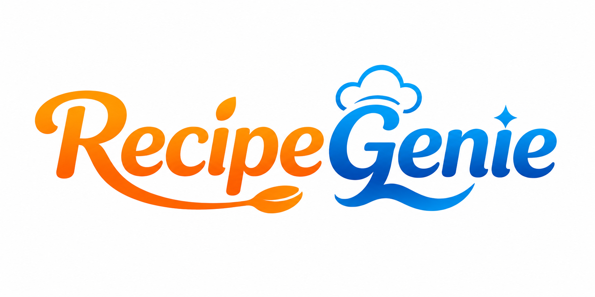

# RecipeGenie

<p align="center">
  
</p>

RecipeGenie is a smart recipe recommendation and health-monitoring web application. Users can add ingredients through text, voice, image detection, or camera capture, find matching recipes, save favorites, track cooked meals, and review nutrition-based health guidance.

## Screenshots

### Home: Ingredient-based recipe search


### Generate Recipe: text, voice, image, and camera input


### Login: secure account access and password reset


## Features

- Ingredient-based recipe filtering from the Firebase recipe collection
- Text input with multi-ingredient parsing
- Voice input using the browser Web Speech API
- Single-ingredient and multi-ingredient YOLO image detection models
- Camera capture for ingredient detection
- AI-style recipe generation with nutrition estimates
- Cuisine-based recipe filtering
- Recipe detail pages with ingredients, cooking steps, nutrition, and health score
- Favorite recipes with direct links from the dashboard
- Cooked-recipe history sorted newest first
- Health tracker with meal summaries and healthy-next-meal recommendations
- Firebase Authentication login, 6-digit email verification, password reset links, and secure password hashing handled by Firebase Auth
- Responsive layouts for desktop and mobile

## Technology

| Area | Tools used |
| --- | --- |
| Backend | Flask, Python |
| Authentication | Firebase Authentication |
| Data | Firebase Realtime Database and Cloud Firestore |
| Recipe data | CSV dataset with recipe image links |
| Computer vision | Ultralytics YOLO, OpenCV |
| Nutrition | Pandas, local nutrition dataset, custom health analysis |
| Frontend | HTML, CSS, JavaScript, Firebase Web SDK |

## Project structure

```text
RecipeGenie/
+-- app.py                    # Flask routes, recipe logic, health tracking, auth APIs
+-- firebase_config.py        # Firebase Admin SDK configuration
+-- nutrition_utils.py        # Nutrition and health-score analysis
+-- nlp_utils.py              # Ingredient and demand parsing helpers
+-- model/                    # YOLO single and multiple ingredient models
+-- archive/                  # Recipe CSV dataset
+-- nutritiondata.xlsx        # Ingredient nutrition data
+-- static/
¦   +-- assets/               # RecipeGenie logo and static assets
¦   +-- css/style.css         # Shared responsive styles
¦   +-- js/app.js             # Client-side interaction logic
+-- templates/                # Flask HTML pages
+-- docs/screenshots/         # README output screenshots
```

## Setup

### 1. Create and activate a virtual environment

```powershell
python -m venv .venv
.\.venv\Scripts\Activate.ps1
```

### 2. Install dependencies

```powershell
pip install -r requirements.txt
```

### 3. Configure Firebase

Place your Firebase Admin service-account key in the project root and update `firebase_config.py` with the matching Realtime Database URL.

The Firebase Web configuration in `static/js/app.js`, the service-account project, Firebase Authentication, Realtime Database, and Firestore should all belong to the same Firebase project.

### 4. Configure email verification

Add these settings to `.env`. Use an app password for Gmail or the SMTP password from your mail provider; never commit this file.

```env
SMTP_HOST=smtp.gmail.com
SMTP_PORT=587
SMTP_USERNAME=your-email@example.com
SMTP_PASSWORD=your-app-password
SMTP_FROM_EMAIL=your-email@example.com
SMTP_USE_TLS=true
```

### 5. Start the application

```powershell
.\.venv\Scripts\python.exe app.py
```

Open `http://127.0.0.1:5500/home`.

## User flows

### Search recipes

1. Add ingredients by typing, speaking, uploading an image, or using the camera.
2. Select `Find Matching Recipes`.
3. Open a matching recipe card to view its detail page.
4. Click `Cooked This` to save the meal to the user dashboard, health tracker, and history.

### Register and verify an account

1. Enter name, email, and a strong password on the Register page.
2. Select `Send verification code`.
3. Enter the six-digit code sent to the registered email.
4. Select `Verify code and create account`.
5. The account is signed in after successful verification.

### Reset password

1. Enter the registered email on the Login page.
2. Select `Send password reset link`.
3. Open the Firebase Auth reset email and choose a new password.

## Firebase data model

- `users/{uid}` in Realtime Database stores user profile, favorites, cooking events, health totals, and notifications.
- `auth_verifications/{uid}` temporarily stores a hashed six-digit registration code and expiry timestamp.
- `all_recipes` in Firestore stores complete recipe documents.
- `recipe_state_index` in Firestore stores recipe IDs grouped by state/cuisine metadata.
- `history` in Firestore stores cooked-recipe history records.

Passwords are never stored in Realtime Database or Firestore. Firebase Authentication securely handles password hashing and login verification.

## Important Firebase note

Recipe listing, health recommendations, and CSV uploads require Cloud Firestore to be enabled in the same Firebase project used by `recipe-genie.json` and `firebase_config.py`. If Firestore is missing, the app can still use Realtime Database features, but recipe data stored in Firestore cannot load.

## Available pages

| Route | Purpose |
| --- | --- |
| `/home` | Ingredient search and recipe recommendations |
| `/recipes-page` | Recipe catalog and cuisine filters |
| `/recipe-detail/<recipe_id>` | Recipe details, cooking steps, and nutrition |
| `/generate-recipe-page` | Generate a recipe from selected ingredients |
| `/dashboard` | Cooking activity, favorites, and insights |
| `/health` | Health score, meal summaries, and recommendations |
| `/history-page` | Newest-first cooked recipe history |
| `/login` | Login and password reset |
| `/register` | Account registration and email verification |

## Validation

```powershell
.\.venv\Scripts\python.exe syntax_check.py
Get-Content static\js\app.js -Raw | node --input-type=module --check
```